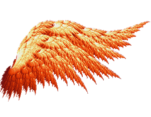

<h1 align="center">About Myself</h1>

- Hi🙋‍♂️, myself **Sam Varghese**, happy to have you here in my profile page🙏.
- I am an 18 year old programming enthusiast 😇.
- Currently I am studying MBATech (MBA+B Tech == MBATech 😊) in Computer Engineering from [NMIMS, Indore](https://nmims.edu/).
- I am from <a href="https://goo.gl/maps/F1N2pFFApSQ8B9Jd9">**Indore, MP, India**</a>
- I like coding, and developing new programs which can be of use to people.

<h1 align="center">🏆My Achievements🏆</h1>

- Cleared <a href="https://www.quora.com/How-can-I-pass-98-381-braindumps">Microsoft 98-381</a> exam. (<a href="Documents\Microsoft_Certified_Professional_Certificate_0.pdf">Certificate</a>, <a href="Documents\microsoft_certified_professional_transcript.pdf">Transcript</a>).
- Cleared <a href="https://www.freecodecamp.org/certification/fccc78dde92-be81-46cf-a740-573ddfe0ee96/javascript-algorithms-and-data-structures">JavaScript Algorithms and Data Structures</a> certification course.
- Got my name among the [top 0.74% for a week at Stack Overflow](Documents/SOWeek.jpeg)
- Got my name among the [top 2% for a month at Stack Overflow](Documents/SOMonth.PNG)

<h1 align="center">My GitHub Stats</h1>

<table width="100%">

<tr>
    <td valign="middle" colspan="3">

</td>
</tr>
<tr>
    <td valign="middle" colspan="3">

</td>
</tr>

<tr>
    <td valign="middle">

</td>
    <td valign="middle">

</td>
    <td valign="middle">

</td>
</tr>
<tr>
    <td valign="middle" colspan="3">

</td>
</tr>
</table>

<h1 align="center" >Tech I Have Come Across</h1>

<h1 align="center"> My Task List </h1>

- [x] Learn Python programming language
- [x] Learn MySQL
- [x] Get into open source
- [ ] Make notes of everything I have learnt
- [x] Learn HTML5
- [x] Learn CSS3
- [x] Learn JavaScript Data Structures And Algorithms
- [ ] Learn NodeJs

<table align="center">
<tr>
    <th colspan="6"><h1 align="center">Connect Through</h1></th>
</tr>
<tr>
    <td valign="middle"></td>
    <td valign="middle"></td>
    <td valign="middle"></td>
    <td valign="middle"></td>
    <td valign="middle"></td>
    <td valign="middle"></td>
</tr>
</table>

